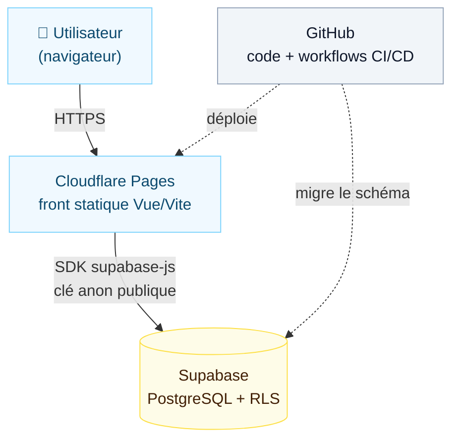
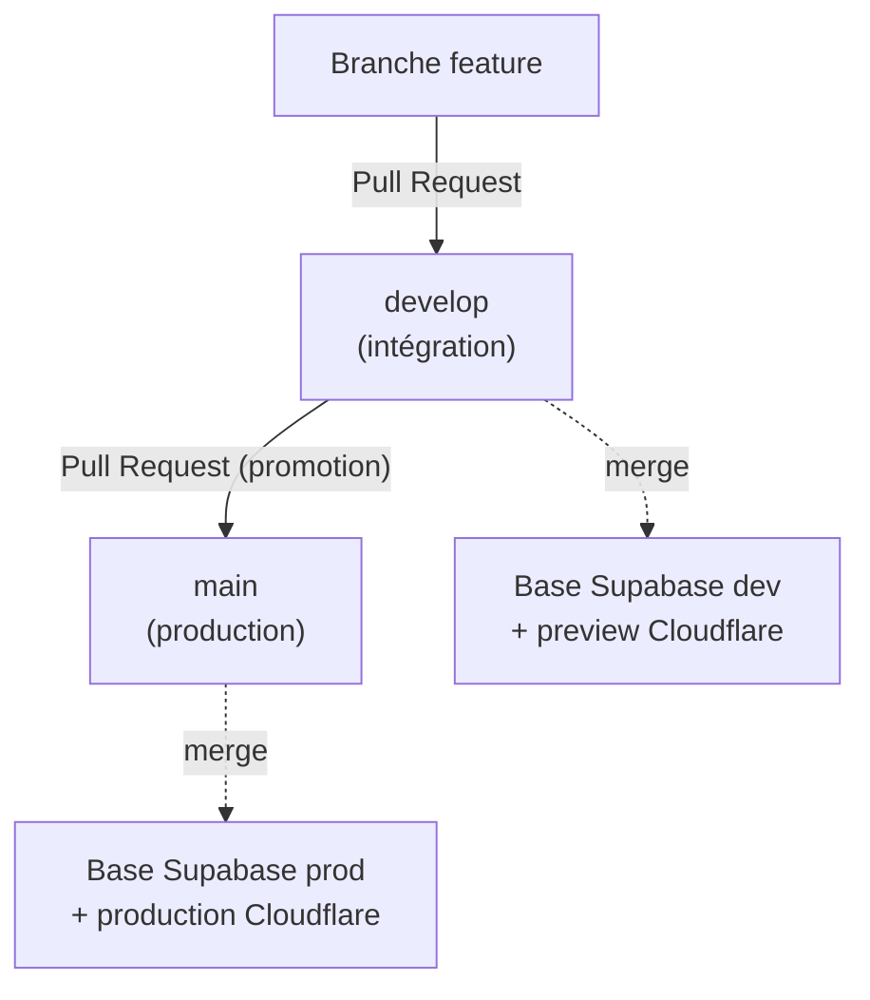
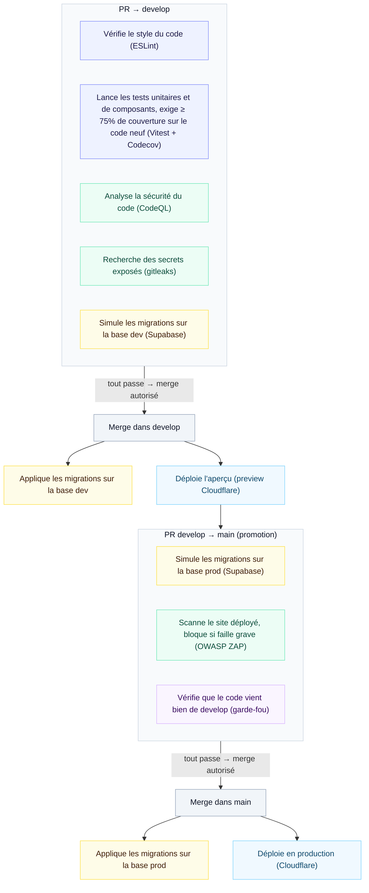

# claude-sandbox — Livre d'or & bac à sable DevSecOps

[](https://github.com/machcoul/claude-sandbox/actions/workflows/ci.yaml)
[](https://github.com/machcoul/claude-sandbox/actions/workflows/codeql.yml)
[](https://codecov.io/gh/machcoul/claude-sandbox)

Un livre d'or minimal (Vue 3 + Supabase) qui sert de **support à une chaîne DevSecOps CI/CD complète**, construite de bout en bout dans le navigateur, sans rien installer localement.

> **L'intérêt de ce dépôt n'est pas le livre d'or** — c'est le pipeline autour. L'application est volontairement simple pour que toute l'attention porte sur l'industrialisation : tests, sécurité, déploiement continu, gouvernance de branches.

---

## Ce que démontre ce projet

Une chaîne d'intégration et de déploiement continus couvrant les grandes familles de contrôle d'une application web moderne :

- **Tests** à trois niveaux : unitaires/composants (Vitest), end-to-end (Playwright), et **couverture** avec seuil bloquant (Codecov).
- **SAST** — analyse statique de sécurité du code (CodeQL).
- **SCA** — analyse des dépendances (Dependabot + `npm audit`).
- **Détection de secrets** sur tout l'historique Git (gitleaks).
- **DAST** — scan dynamique du site déployé (OWASP ZAP), bloquant sur la promotion en production.
- **Durcissement** — en-têtes de sécurité HTTP et Content-Security-Policy.
- **Déploiement continu** sur Cloudflare Pages, avec environnements **dev** et **prod** séparés.
- **Migrations de base versionnées** appliquées automatiquement par branche (Supabase).
- **Gouvernance de branches** : promotion contrôlée `develop → main`, chaque contrôle placé là où il a du sens.
---

## Stack

| Couche | Technologie |
|---|---|
| Frontend | Vue 3, Vite |
| Base de données & API | Supabase (PostgreSQL, Row Level Security) |
| Hébergement | Cloudflare Pages (statique + CDN) |
| CI/CD | GitHub Actions |
| Tests | Vitest, @vue/test-utils, Playwright |
| Qualité & sécurité | ESLint, Prettier, CodeQL, gitleaks, Codecov, OWASP ZAP, Dependabot |

---

## Architecture



Deux lectures se superposent : le **flux d'exécution** (traits pleins) — l'utilisateur accède au front via Cloudflare, qui interroge Supabase directement ; et le **flux de livraison** (traits pointillés) — GitHub déploie le front et applique les migrations. Le front est **statique**, sans logique serveur propre : la sécurité d'accès aux données repose sur la **Row Level Security** de Supabase, et le schéma est **versionné** dans `supabase/migrations/`.

---

## Pipeline CI/CD

Deux branches protégées, un flux à sens unique : `feature → develop → main`. Un **garde-fou** bloque au merge toute PR vers `main` ne provenant pas de `develop` — la promotion en production est donc mécaniquement contrainte, pas seulement conventionnelle.



Chaque contrôle tourne **là où il a du sens, une seule fois** : la qualité et la sécurité du *code* sont validées à l'entrée de `develop` ; la promotion vers `main` ne rejoue que ce qui concerne spécifiquement la mise en production. Le garde-fou `source = develop` garantit qu'aucun code n'atteint la production sans être passé — et avoir été testé — par `develop`.

| Étape (action Git) | Contrôles déclenchés | Bloquant |
|---|---|---|
| **PR → `develop`** | `build` (lint + tests + couverture), `codecov/patch` (≥75% du code neuf), CodeQL, gitleaks, `migration-check` (dry-run vs base **dev**) | Oui |
| **Merge dans `develop`** | Migrations réelles vers base **dev** ; déploiement **preview** Cloudflare | — |
| **PR `develop` → `main`** | `migration-check` (dry-run vs base **prod**), **OWASP ZAP** (scan de la preview develop, bloquant sur High/Critical), garde-fou « source = develop » | Oui |
| **Merge dans `main`** | Migrations réelles vers base **prod** ; déploiement **production** Cloudflare | — |
| **Planifié (hebdo)** | CodeQL (re-scan), Dependabot (dépendances) | — |

**Garanties à l'entrée en production** : aucun code n'atteint `main` sans provenir de `develop` (donc déjà testé), sans migrations valides contre la base de prod, et sans scan dynamique du site déployé exempt de faille High/Critical.

Le déclenchement des actions automatiques, étape par étape :



**Catégories** — chaque étape appartient à une famille de contrôle :

| Couleur | Catégorie | Rôle |
|---|---|---|
| 🟦 Indigo | **Qualité de code** | Le code est-il propre, testé, suffisamment couvert ? |
| 🟩 Vert | **Sécurité** | Le code et le site déployé sont-ils exempts de failles et de secrets ? |
| 🟨 Jaune | **Base de données** | Les migrations de schéma sont-elles cohérentes (dev et prod) ? |
| 🟦 Bleu clair | **Déploiement** | Le code est-il livré (preview, production) ? |
| 🟪 Violet | **Gouvernance** | Le circuit `develop → main` est-il respecté ? |

Les contrôles listés dans chaque bloc sont **bloquants** : le merge n'est possible que s'ils passent tous. Les étapes sous les merges (migrations, déploiements) sont **automatiques et post-merge** : elles s'exécutent une fois le code intégré.

---

## Prérequis

Selon ce que tu veux faire, les besoins diffèrent.

**Pour faire tourner l'application en local :**
- **Node.js 20+** et **npm**
- Un **projet Supabase** (gratuit) — sans ses identifiants (URL + clé anon), l'app se lance mais le livre d'or ne peut ni lire ni écrire
**Pour développer sans rien installer (recommandé) :**
- Un simple **navigateur** suffit : le dépôt se développe directement dans **GitHub Codespaces** (VS Code dans le navigateur, environnement préconfiguré). C'est ainsi que le projet a été construit à l'origine.
**Pour travailler sur les migrations de base :**
- La **CLI Supabase** (installée via npm dans le projet) et un **jeton d'accès Supabase**
**Pour lancer les tests end-to-end :**
- Les navigateurs Playwright, à installer une fois : `npx playwright install`
**Pour reproduire le déploiement complet (CI/CD) :**
- Des comptes **GitHub**, **Cloudflare** (Pages), **Supabase** et **Codecov**
- Cinq secrets à configurer dans GitHub Actions : `SUPABASE_ACCESS_TOKEN`, `DEV_PROJECT_ID`, `DEV_DB_PASSWORD`, `PROD_PROJECT_ID`, `PROD_DB_PASSWORD`
- Deux fonctionnalités GitHub à activer : **code scanning (CodeQL)** et **Dependabot**
- Cloudflare Pages connecté au dépôt (build `npm run build`, sortie `dist`) avec les variables `VITE_*` par environnement
À noter : Codecov, gitleaks et OWASP ZAP ne requièrent aucun token supplémentaire sur un dépôt public (Codecov via upload sans token ; gitleaks et ZAP via le `GITHUB_TOKEN` fourni automatiquement).

## Démarrage local

```bash
# 1. Installer les dépendances
npm install

# 2. Configurer l'accès Supabase
cp .env.local.example .env.local
# puis renseigner VITE_SUPABASE_URL et VITE_SUPABASE_ANON_KEY
# (dashboard Supabase → Project Settings → API)

# 3. Lancer le serveur de développement
npm run dev
```

L'application est alors disponible en local (Vite indique l'URL, par défaut `http://localhost:5173`).

---

## Scripts disponibles

| Commande | Rôle |
|---|---|
| `npm run dev` | Serveur de développement (hot reload) |
| `npm run build` | Build de production (dossier `dist/`) |
| `npm run preview` | Prévisualisation locale du build |
| `npm run lint` | Analyse ESLint |
| `npm run format` | Formatage Prettier |
| `npm run test` | Tests unitaires et de composants (Vitest) |
| `npm run test:coverage` | Tests + rapport de couverture |
| `npm run test:e2e` | Tests end-to-end (Playwright) |

---

## Structure du projet

```
.
├── src/                     # Application Vue
│   ├── App.vue              # Composant principal (livre d'or)
│   ├── App.test.js          # Tests unitaires/composants (Supabase mocké)
│   ├── lib/supabase.js      # Client Supabase (variables VITE_*)
│   └── main.js
├── e2e/                     # Tests end-to-end Playwright (réseau mocké)
├── supabase/migrations/     # Schéma versionné (table messages + RLS)
├── public/_headers          # En-têtes de sécurité Cloudflare (CSP, etc.)
├── .github/workflows/       # CI/CD : ci, codeql, gitleaks, zap, deploy
├── codecov.yml              # Seuil de couverture (patch 75%)
└── vite.config.js           # Config Vite + Vitest (couverture)
```

---

## Choix assumés

Ce projet étant un bac à sable d'apprentissage, certains choix sont volontairement simplifiés — les nommer fait partie de la démarche :

- **Policies Supabase ouvertes** (lecture/écriture publiques pour le rôle `anon`) : adapté à un livre d'or de démonstration, à restreindre pour un usage réel.
- **`style-src 'unsafe-inline'` dans la CSP** : nécessaire car Vite injecte des styles en ligne ; compromis courant et documenté pour ce type d'application.
- **Tests E2E hors CI** : le parcours Playwright s'exécute manuellement (`npm run test:e2e`), pas encore intégré au pipeline automatique.
---

## Statut

Projet personnel d'apprentissage. Le livre d'or fonctionne, mais la valeur du dépôt réside dans sa chaîne CI/CD, décrite ci-dessus.
